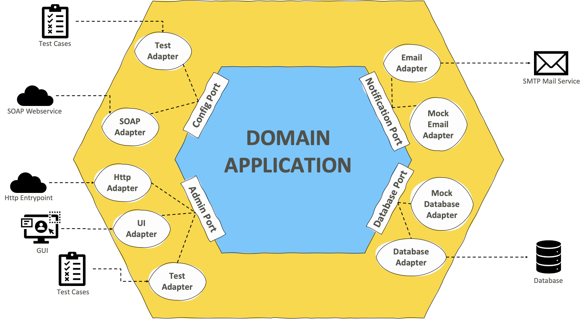

# go-hexagonal

simple golang project to understand hexagonal architecture

## concept



## run 

```
# create containers
$ docker-compose up -d

# exec bash container
$ docker exec -it [ID-CONTAINER] bash

# runner tests
$ go test ./...

```

## Author
[@moroleandro](https://moroleandro.com)